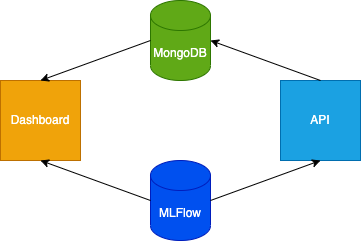

# POC-MLOPS

A proof of concept for implementing MLOps.

Influenced by [Made With ML](https://madewithml.com/).

## System Design

## Considerations

- The API model training endpoint could act as a trigger to train a model on a distributed computing network.
- Utility functions should be implemented. This would allow more consistent results across the system when more complicated models are considered.
  - Transform function such that data is the same when either training or predicting.

## To-Do

- Add model registry
- Add drift monitoring to dashboard
- Add S3 equivalent for storage between model training phases, model storage etc
